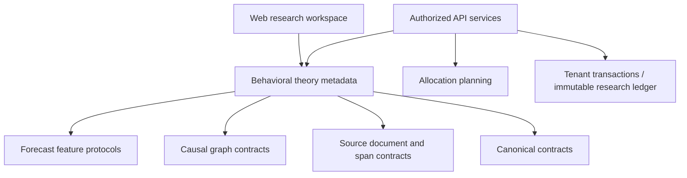

# Repository audit inventory

Generated from the initial tracked tree and workspace manifests on 2026-09-05. File inventory is coverage bookkeeping, not proof of semantic review. Methodology documents and domain tests define public contracts; the audit report distinguishes findings from unreviewed scope.

| Workspace | Name | Internal dependencies | Consumers | Files | Test files | Public entry |
|---|---|---|---|---|---|---|
| apps/api | @economyos/api | @economyos/capital-allocation, @economyos/config, @economyos/contracts, @economyos/data-admission, @economyos/observability, @economyos/security | none | 50 | 19 | application boundary |
| apps/web | @economyos/web | @economyos/design-tokens, @economyos/i18n | none | 36 | 1 | application boundary |
| packages/canonical-data | @economyos/canonical-data | @economyos/contracts | services/ingestion-worker | 8 | 2 | packages/canonical-data/src/index.ts |
| packages/capital-allocation | @economyos/capital-allocation | none | apps/api | 10 | 2 | packages/capital-allocation/src/index.ts |
| packages/causal-graph | @economyos/causal-graph | none | none | 10 | 1 | packages/causal-graph/src/index.ts |
| packages/causal-inference | @economyos/causal-inference | none | none | 16 | 2 | packages/causal-inference/src/index.ts |
| packages/collaboration-ecosystem | @economyos/collaboration-ecosystem | none | none | 21 | 7 | packages/collaboration-ecosystem/src/index.ts |
| packages/config | @economyos/config | none | apps/api | 5 | 1 | packages/config/src/index.ts |
| packages/contracts | @economyos/contracts | none | apps/api, packages/canonical-data, packages/economic-state, packages/security | 5 | 1 | packages/contracts/src/index.ts |
| packages/crisis-engine | @economyos/crisis-engine | none | none | 13 | 4 | packages/crisis-engine/src/index.ts |
| packages/data-admission | @economyos/data-admission | none | apps/api, packages/economic-state, services/ingestion-worker | 9 | 2 | packages/data-admission/src/index.ts |
| packages/design-tokens | @economyos/design-tokens | none | apps/web | 6 | 1 | packages/design-tokens/src/index.ts |
| packages/economic-state | @economyos/economic-state | @economyos/contracts, @economyos/data-admission | none | 9 | 4 | packages/economic-state/src/index.ts |
| packages/enterprise-hardening | @economyos/enterprise-hardening | none | none | 14 | 3 | packages/enterprise-hardening/src/index.ts |
| packages/forecasting-engine | @economyos/forecasting-engine | none | none | 15 | 4 | packages/forecasting-engine/src/index.ts |
| packages/i18n | @economyos/i18n | none | apps/web | 5 | 1 | packages/i18n/src/index.ts |
| packages/model-governance | @economyos/model-governance | none | none | 16 | 5 | packages/model-governance/src/index.ts |
| packages/narrative-intelligence | @economyos/narrative-intelligence | none | none | 11 | 1 | packages/narrative-intelligence/src/index.ts |
| packages/object-storage | @economyos/object-storage | none | services/ingestion-worker | 5 | 1 | packages/object-storage/src/index.ts |
| packages/observability | @economyos/observability | @economyos/security | apps/api | 5 | 1 | packages/observability/src/index.ts |
| packages/scenario-lab | @economyos/scenario-lab | none | none | 18 | 5 | packages/scenario-lab/src/index.ts |
| packages/security | @economyos/security | @economyos/contracts | apps/api, packages/observability | 10 | 3 | packages/security/src/index.ts |
| packages/simulation-engine | @economyos/simulation-engine | none | none | 15 | 4 | packages/simulation-engine/src/index.ts |
| packages/systemic-risk | @economyos/systemic-risk | none | none | 11 | 2 | packages/systemic-risk/src/index.ts |
| services/ingestion-worker | @economyos/ingestion-worker | @economyos/canonical-data, @economyos/data-admission, @economyos/object-storage | none | 28 | 9 | application boundary |

## Source scan

487 tracked files; 38 forward migrations at baseline. No ignored/untracked user artifacts were present before dependency installation.

## Dependency graph audit

Current manifest graph: 27 workspaces. Directed-cycle scan: none. Scientific source imports scanned for direct SQL/HTTP/UI/framework/filesystem dependencies: none found. This lexical/manifest check cannot prove all transitive runtime boundaries.

Other scientific packages retain their existing public index exports and tests; no existing scientific package depends on either new context. The web receives a server-side projection of registry metadata and does not import numerical kernels into client components.
