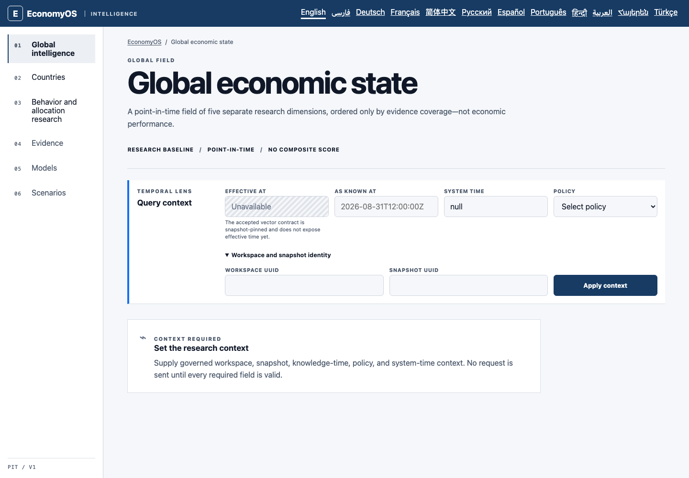
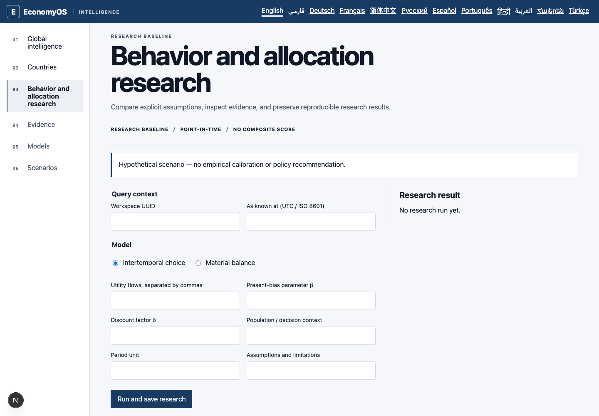
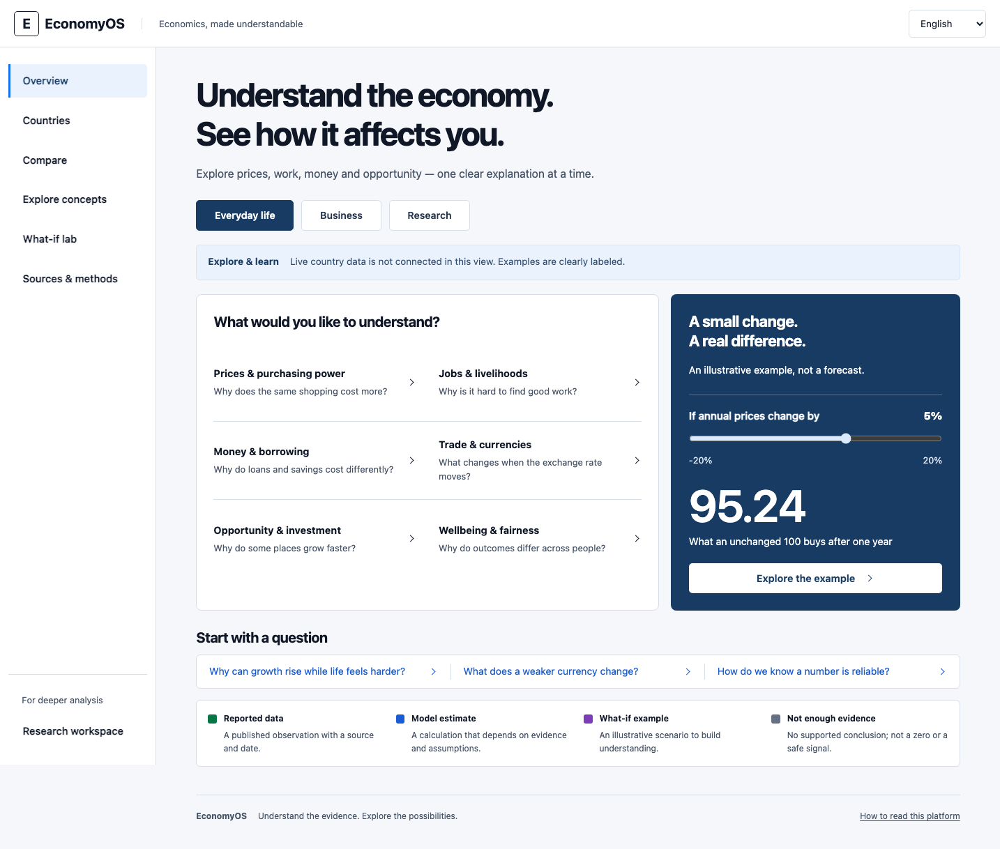
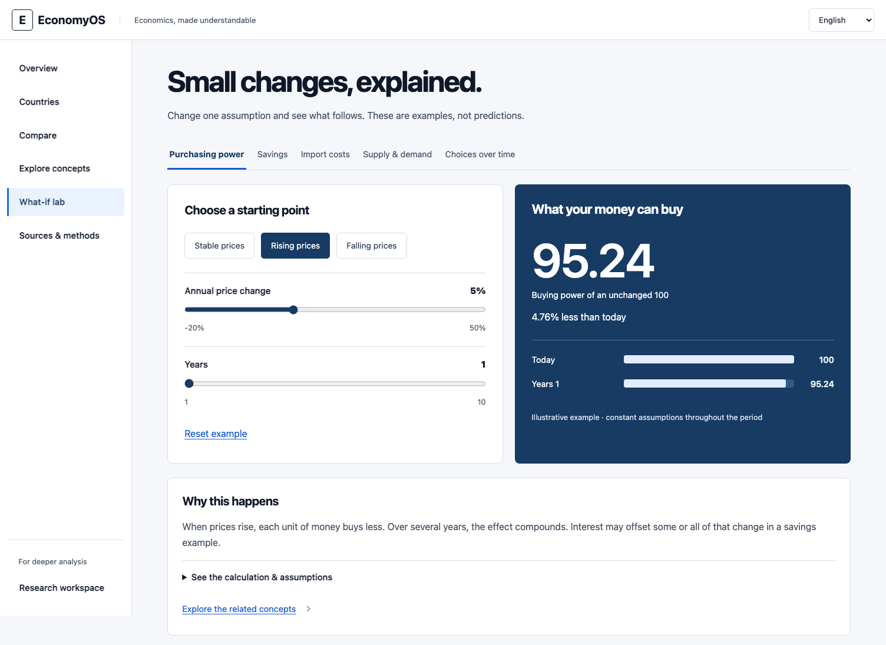
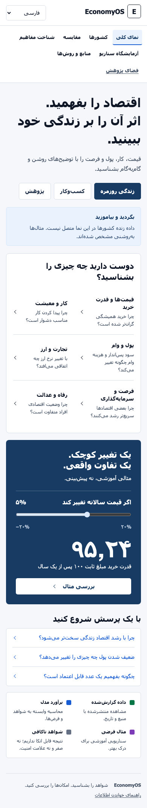
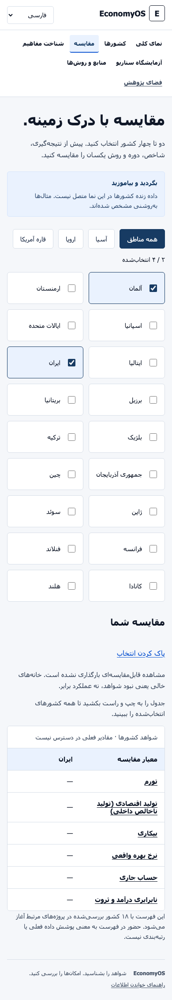
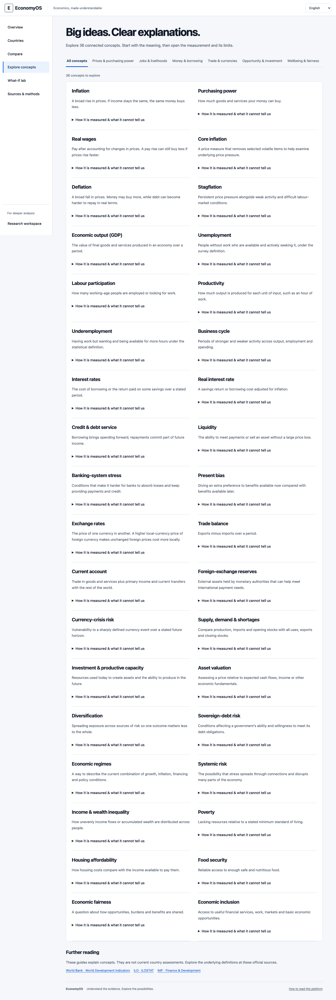

# EconomyOS: public experience review and redesign

Review date: 6 September 2026. This review combines code inspection, a captured walkthrough of the original interface, economic-method checks, and implementation of the redesigned experience. The roles below are review perspectives applied by one reviewer, not a claim that independent specialists or user participants were consulted.

## Product identification

EconomyOS should help people understand economic conditions, their implications and the strength of the evidence. Its audiences include households, businesses, economic analysts, researchers and other economic participants. The repository currently supplies a substantial governed research foundation, but does not include a ready-to-use public country dataset or browser authentication gateway.

The original entry journey asked people to configure infrastructure before they could investigate an economic question. The redesign provides immediate educational value and a clear path to the existing authorized reports. It does not invent current economic readings to make an empty installation look populated.

## Required review roles and findings

| Role | Responsibility | Finding and disposition |
| --- | --- | --- |
| Product strategist / product owner | Identify audiences, user problems, useful first action and release boundary | **High: addressed.** The homepage was a foundation-status page, and the next step was a research-context form. It now opens an overview with everyday, business and research perspectives. Live reporting remains a separate integration dependency. |
| Macroeconomist / economic-domain reviewer | Definitions, units, interpretation, distributional implications | **High: addressed in the learning layer.** Explain inflation versus price levels, real versus nominal values, output versus wellbeing, and reserves versus accessible reserves. Each of 36 concepts includes a measure and an interpretation limit. |
| Quantitative methods / algorithm reviewer | Formula correctness, assumptions, missingness, validation and causality | **Addressed for the new examples.** Purchasing power uses compound deflation; savings use the exact real-return identity; currency examples specify quote direction. Supply and intertemporal examples execute the existing package kernels. **Open:** empirical validation of the wider engines is not established by unit tests. |
| Data / provenance engineer | Source dates, availability, revisions, coverage and comparable evidence | **High: addressed in presentation.** Missing reports stay unavailable, and scenarios stay separate from observations. **Open:** dataset admission, named authorized report discovery and production source ingestion are required for current country reporting. |
| Software architect / code reviewer | Component boundaries, integration correctness and maintainability | **Medium: fixed.** The global directory discarded `nextCursor`; it now exposes pagination. Country lookup now respects the selected `vectorId`. Public components share navigation, content and numerical helpers; the original governed routes remain available. |
| Security / privacy reviewer | Authentication, authorization, tenant boundaries and safe failure | **Preserved.** Membership checks remain database-backed and intersect token scope. No guest principal, fabricated workspace, token form or authorization bypass was introduced. Requests now have a 15-second timeout. This was not a penetration test or deployment audit. |
| UX researcher / information architect / content designer | Discoverability, cognitive load, task flow, plain language and empty states | **High: addressed.** Technical setup is removed from default journeys. Visitors choose topics, countries, presets and sliders. Methodology expands progressively. Empty states explain both the missing evidence and a useful next action. Human comprehension testing is still needed. |
| Visual / interaction designer | Typography, hierarchy, navigation, spacing, responsive behavior and feedback | **Addressed.** White navigation and navy examples use the existing product palette. Topic rows, comparison tables and an interactive calculation have distinct visual roles. Disabled product-navigation placeholders were replaced by working destinations. |
| Accessibility / localization reviewer | Keyboard use, semantics, labels, contrast, reflow, RTL and language identification | **Implemented and tested.** Semantic controls, skip navigation, visible focus, live result announcements and text alternatives accompany visual encodings. New learning content is English/Persian; other locales retain translated navigation and explicitly marked English learning content. Automated checks do not establish complete WCAG compliance. |
| QA / reliability / release reviewer | Regression coverage, interaction tests, builds and truthful completion claims | **Implemented.** Retain specialist tests, add selection-only journey tests, verify formulas and missingness, and test desktop/mobile English and Persian. Production readiness still depends on infrastructure and empirical gates documented elsewhere. |

## Original walkthrough evidence

1. **Open global intelligence — blocked for a general visitor.** The first screen foregrounded UTC timestamps, policy identifiers, `null`, workspace UUID and snapshot UUID. No economic content was available without completing the form. The disabled effective-time field also explained an implementation contract to the visitor.

   

2. **Open research — high cognitive load.** The next screen asked for utility lists, Greek-letter parameters, population and assumptions before any example appeared. It correctly labeled hypothetical results, but did not help an ordinary visitor learn what the inputs meant.

   

The screenshots establish visible hierarchy and friction. They do not prove how representative users behave or understand the material.

## Implemented information architecture

| Destination | Public task | Interaction | Economic scope |
| --- | --- | --- | --- |
| Overview | Find an economic question relevant to me | Choose everyday life, business or research; open a topic or example | Six economic topic families, an interactive purchasing-power example and an evidence legend |
| Countries | Explore a country through meaningful questions | Select a region and a named country | Initial 18-country directory; explicit report availability; no fabricated country statistics |
| Compare | Set up a meaningful comparison | Select 2–4 named countries; shareable URL; clear selection | Same measure, period and method; unavailable observations remain empty and labeled |
| Explore concepts | Understand a term and its limits | Browse six topics; select a concept; expand measurement details | 36 concepts, from inflation and employment to systemic risk, food security and fairness |
| What-if lab | Learn how a change affects an outcome | Presets and accessible sliders; reset; expandable assumptions | Purchasing power, real savings, imported input costs, material balance and quasi-hyperbolic choice |
| Sources & methods | Judge the evidence behind an assertion | Six expandable questions and official reference links | Data classes, historical availability, uncertainty, causality, calibration and comparability |
| Research workspace | Conduct an explicit specialist calculation | Deliberate advanced entry | Existing authenticated immutable research flows, with their original input validation and evidence boundaries |

The public journeys have no free-text, UUID, code or numeric-entry fields. Numeric assumptions use bounded sliders. Advanced research retains explicit input forms because constructing an arbitrary research specification is a different task. Existing complete authorized report URLs still load governed data; their report settings and technical provenance are collapsed initially.

## Economic and algorithm review

The repository’s economic-state baseline declares `explicit_abstain_no_imputation` (`packages/economic-state/src/research-baselines.ts`). The public experience preserves this principle: a missing production input produces an unknown material balance, and missing country data produces no score. It does not turn the five model dimensions into a country ranking.

The new purchasing-power example uses `100 × ((1 + interest) / (1 + inflation)) ^ years`. At 5% inflation with no interest, unchanged money buys 95.24 after one year, not 95. The import example changes a quote measured as local currency per foreign currency, holds foreign prices and domestic costs constant, and applies the change only to the imported cost share. This avoids confusing a percentage change in a quote with the inverse currency’s depreciation.

The material-balance presets call `computeMaterialBalance` from `packages/allocation-planning`; the choice presets call `quasiHyperbolicUtility` from `packages/behavioral-economics`. These run on the server and pass serializable results to the page, so the browser does not import the packages’ Node.js hashing dependencies. Hypothetical quantities, time units and parameter values are disclosed, and examples are not persisted as admitted observations.

Two wider methodological issues remain outside a UI redesign:

- The crisis alert policy permits an uncalibrated severity ceiling of either `watch` or `warning` (`packages/crisis-engine/src/alerts.ts:106`). The related FX project describes a stricter uncalibrated watch ceiling. This requires an explicit policy decision before publishing public alerts; the redesign does not expose either as a validated public warning.
- Capital assessment explicitly declares research-only, prohibited decision use (`packages/capital-allocation/src/assessment.ts:67`). Interface polish must not be treated as model validation or as permission to turn those outputs into investment advice.

## Relationship to the three reference projects

The reference review covered their public READMEs and documented scientific contracts, not a complete independent audit of their Python implementations.

- [Countries Investment Model](https://github.com/ildrm/countries-investment-model): informs the distinction between economic backdrop and asset valuation. Public concepts explain why supportive macro conditions do not establish an attractive purchase price.
- [Foreign Exchange Crisis Early Warning System](https://github.com/ildrm/foreign-exchange-crisis-early-warning-system): informs separate hazards, declared horizons, evidence gates and probability calibration. The public guide explains why a risk score cannot automatically be read as a probability.
- [Humanity Economy](https://github.com/ildrm/humanity-economy): informs household pressure, distribution, basic needs and caution around normative proxies. The guide does not infer famine from inflation or moral judgments from structural indicators.

These sources are linked in the interface. They have not been represented as newly integrated live feeds. Official World Bank, ILO and IMF reference links are for definitions and further reading; publication here does not claim that every linked source has been ingested.

## Visual specification and verification

The built-in image generator produced [overview](evidence/design-concept.png) and [lab](evidence/lab-concept.png) concepts before implementation. Prompts specified the existing navy/gray palette, clear public navigation, no UUID forms, no invented live readings, fully readable code-native controls, economic explanations, and a labeled illustrative calculation. The lab concept additionally specified five example modes, preset controls, sliders, result bars and expandable assumptions.

The built-in in-app browser and Chrome provider were both unavailable. Screenshots and browser verification therefore use the repository’s installed Playwright Chromium. Concepts and resulting screenshots were opened with `view_image`.

| Comparison point | Implementation decision |
| --- | --- |
| Page composition | Same quiet white header, left navigation, gray main canvas, topic panel and navy example panel |
| Palette | Retained `#173b63`, `#f5f7fa`, `#101828`, white surfaces and cool gray rules |
| Typography | Large two-line overview heading; readable 16px body; deliberate control and small-text sizing |
| Interactions | Audience choices change questions; topic links resolve; country filters and selections work; lab values update immediately |
| Containers and spacing | Open topic rows inside one panel; distinct example panel; compact evidence legend; responsive stacking |
| Copy accuracy | Intentional clarifications: “unchanged 100,” “in this view,” and “annual prices change” prevent suggesting live data or ambiguous deflation behavior |
| Intentional deviations | Omitted decorative icons to keep the interface simple; preserved native slider/selection affordances; explained model estimates without claiming all models are established; compact mobile navigation replaces the fixed sidebar |

The report includes retained before/after evidence because an audit was requested. Runtime and test-generated cache artifacts are not deliverables.

## Remaining release work

Current country reporting still needs admitted observations, authorized named report discovery and a configured browser session gateway. The public comparison is a working selection and interpretation flow with explicit unavailable values until those reports exist. Full localization of the new learning content beyond English and Persian, human accessibility review, representative comprehension testing, and wider empirical model validation remain necessary. None of these are silently substituted with synthetic live statistics.

## Final verification

- **Unit tests:** 1,173 passed across 94 files, including the five new tests covering compound purchasing power, exact real returns, quote direction, engine-backed presets, missing inputs and bilingual concept completeness.
- **Type checking, lint and repository validation:** passed across the workspace. The repository verifier excludes the intentional PNG review evidence from text checks.
- **Production build:** passed after the final stylesheet correction; all 65 generated pages completed.
- **Browser regression:** exercised 144 desktop/mobile cases, including existing specialist flows and navigation/accessibility checks across all 12 locales. The final full run passed 142 cases and exposed two English/Persian mobile comparison overflow failures. After containing the table's visually hidden labels within its scroll wrapper, all six affected comparison cases passed on rerun. This is a combined verification result, not a claim that a subsequent full 144-case run occurred.
- **Interaction corrections:** country selection now updates its shareable URL synchronously through Next.js-supported browser history integration; mobile page width stays within the viewport while wide comparison tables scroll locally. Existing report pagination and selection of a particular country vector have regression coverage.
- **Visual review:** opened the generated concepts and final desktop/mobile screenshots. Checked hierarchy, spacing, typography, colors, responsive navigation, Persian right-to-left layout and the distinction between illustrative examples and unavailable reports. Representative user comprehension and manual assistive-technology testing remain release work.

## Redesigned walkthrough evidence

1. **Open the overview — working without setup.** Visitors can select an audience, explore six economic topics, change a purchasing-power assumption and follow relevant questions. The data-availability notice and evidence legend are visible.

   

2. **Open the what-if lab — working without typed inputs.** Five examples expose their assumptions through presets and sliders. Results, limitations and expandable formulas explain what changed and why.

   

3. **Use Persian on a phone — working responsive navigation and RTL.** Reading order, audience choices, explanations and calculation controls remain visible within the viewport.

   

4. **Compare countries on a phone — working selection and contained table scrolling.** Named country choices replace identifiers. Fixed column sizing makes the first country visible beside the measure, and a localized hint explains sideways scrolling. Empty observations remain explicitly unavailable, and measure explanations remain accessible.

   

5. **Explore concepts — working topic browsing and progressive explanation.** Each concept connects a plain-language definition to measurement and an interpretation boundary.

   
